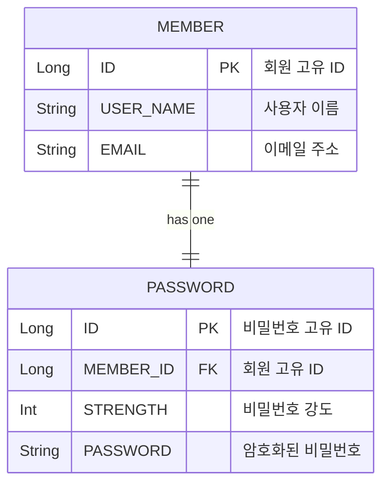

# :entity:password

```mermaid
erDiagram
    MEMBER {
        Long ID PK "회원 고유 ID"
        String USER_NAME "사용자 이름"
        String EMAIL "이메일 주소"
    }
    PASSWORD {
        Long ID PK "비밀번호 고유 ID"
        Long MEMBER_ID FK "회원 고유 ID"
        Int STRENGTH "비밀번호 강도"
        String PASSWORD "암호화된 비밀번호"
    }

    MEMBER ||--|| PASSWORD : "has one"
```
